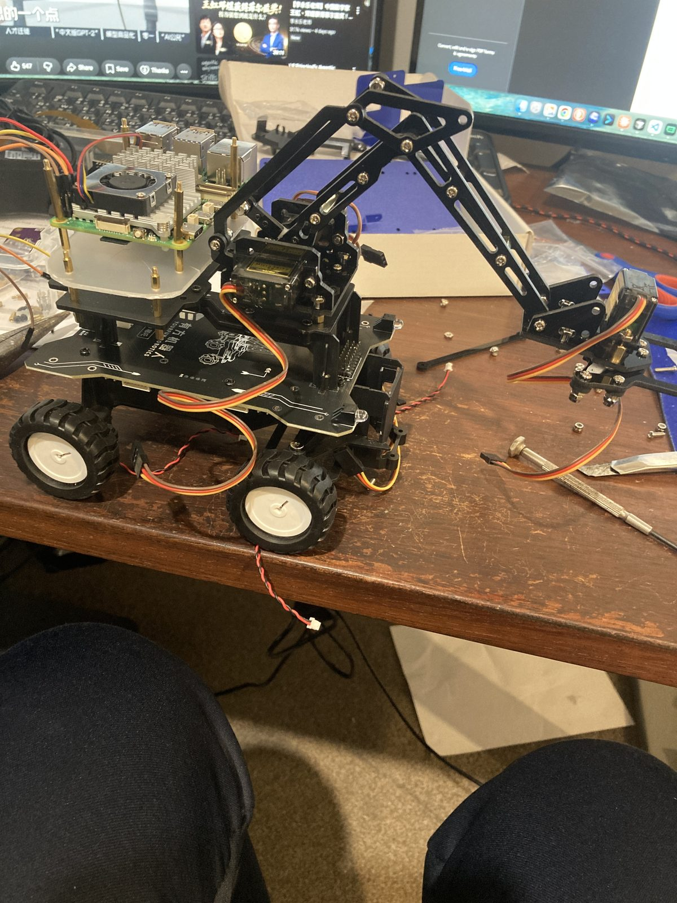

# Car and Robotic Arm



A Raspberry Pi 5 smart car and robotic arm build: real hardware, verified wiring, and a
step-by-step engineering record from first I2C probe to autonomous line-following. This README
is a map of the repository for a first-time visitor — an assessor, a collaborator, or future me.

[Live Site](https://1dannyyu.github.io/IRSENSORCAR/) · [Inventory](https://1dannyyu.github.io/IRSENSORCAR/inventory/) · [Assembly Guide](https://1dannyyu.github.io/IRSENSORCAR/assembly-guide/) · [GitHub Repository](https://github.com/1DannyYu/IRSENSORCAR) · [Contact Danny on GitHub](https://github.com/1DannyYu)

## What This Project Is

A Yourfun NeZha driver board, controlled by a Raspberry Pi 5 over I2C, drives a four-wheel
chassis and a 3-DOF robotic arm. On top of that base sit three sensing systems — a Raspberry Pi
AI Camera (IMX500), an HC-SR04 ultrasonic sensor, and a 4-channel IR line-tracing sensor — used
for obstacle avoidance, line following, AprilTag-based localization, and room mapping. Every
claim about hardware behavior in this repo (motor direction, I2C register meanings, timing) was
reconstructed and verified against the physical robot rather than assumed from vendor
documentation, because the vendor SDKs disagree with each other (see [ADR 0004](docs/adr/0004-nezha-python-driver-port.md)).

The project also doubles as a school Software Engineering assessment; see
[For Examiners and Teachers](#for-examiners-and-teachers) below for the assessment-specific paper trail.

## Current Status

| Area | Status |
|---|---|
| I2C communication | Verified at address `0x40` |
| Motor mapping | Verified and written back into `src/carbot/config.py` |
| Driving test | First low-speed ground run passed |
| AI Camera (IMX500) | Intrinsics, undistortion, still capture, and fixed-wall room pose verified (2026-08) |
| Obstacle sensor (HC-SR04) | Wiring verified, distance readings OK (2026-08) |
| Room mapping | Vision anchor ready; autonomous exploration scripts require timing fixes before use |
| IR line following | Ten-phase Map 1 route staged and under active tuning ([tasks/ir-sensor-tracking/](tasks/ir-sensor-tracking/)) |
| Robotic arm | Still evolving because of damaged parts and compatibility tradeoffs |

## How to Explore This Repo

There is no single "read the whole thing" path — start from whichever question you have:

| I want to... | Go to |
|---|---|
| See what the robot looks like and what parts it's built from | [Live Site](https://1dannyyu.github.io/IRSENSORCAR/) and [Inventory](https://1dannyyu.github.io/IRSENSORCAR/inventory/), backed by photos in [assets/](assets/) |
| Understand a hardware decision or a verified fact (wiring, protocol, timing) | [docs/hardware/](docs/hardware/) and [docs/adr/](docs/adr/) |
| Read the Python that drives the robot | [src/carbot/](src/carbot/) — one module per subsystem (motors: `car.py`/`motion.py`, camera: `vision.py`, IR: `ir_line_nav.py`, etc.) |
| Run a hardware check myself | [examples/](examples/) — numbered, runnable scripts; see [Repeatable Hardware Checks](#repeatable-hardware-checks) below |
| Check that the code is actually tested | [tests/](tests/) — one test file per module in `src/carbot/` |
| Follow the day-to-day engineering trail (what changed, why, what broke) | [docs/progress/](docs/progress/) for dated work logs, [docs/handoff-*.md](docs/) for point-in-time continuation notes |
| See the reasoning behind a major choice (why this driver architecture, why this mapping approach) | [docs/adr/](docs/adr/) |
| Get the full operator/technical reference (bring-up steps, every example script, the IR workflow, SSH access) | [docs/project-reference.md](docs/project-reference.md) |
| Understand file naming and where new files should go | [CONVENTIONS.md](CONVENTIONS.md) |
| See the working notes for one specific task (e.g. IR line tracking, 3D mapping) | [tasks/](tasks/) — one directory per task |

## Repository Layout

```
Car-and-Robotic-Arm/
├── README.md              You are here
├── docs/                  Written record: hardware facts, setup guides, decisions, progress logs
│   ├── hardware/          Verified specs, protocol notes, wiring
│   ├── setup/             Bring-up and environment setup guides
│   ├── adr/               Architecture decision records (why, not just what)
│   ├── progress/          Dated logs of completed, verified work
│   ├── reflections/       Project reflection and engineering-role write-ups
│   ├── Mechatronics Folio and Journal/   School assessment materials
│   └── project-reference.md   Full technical/operator reference
├── src/carbot/            The importable Python driver and control package
├── examples/              Runnable, numbered scripts that exercise real hardware
├── tests/                 Automated tests (pytest)
├── tasks/                 Per-task working notes and run books
├── assets/                Build photos and reference diagrams
└── site/                  Astro source for the live project website
```

`vendor/` is reserved for third-party material and stays read-only when used (see
[CONVENTIONS.md §4](CONVENTIONS.md#4-vendor-import-rules)); it is currently empty — the imported
NeZha SDK/manual and BCM2711 datasheet were removed once the facts they sourced were fully
captured in [docs/hardware/](docs/hardware/) and [ADR 0004](docs/adr/0004-nezha-python-driver-port.md).

See [CONVENTIONS.md](CONVENTIONS.md) for the full layout and naming rules.

## Repeatable Hardware Checks

Every `examples/NN_<tool>_<function>.py` script names the hardware it drives in its filename
(`cam`, `sonar`, `ir`, `motor`, `servo`, `i2c`, `power`) — see
[CONVENTIONS.md §3.6](CONVENTIONS.md#36-runnable-scripts-in-examples-nn_tool_function_modepy).
Scripts that only read sensors are safe to run over SSH; anything that moves a motor or servo
requires an operator standing beside the robot who can cut power instantly (see
[Safety](#safety)).

```bash
uv sync
uv run python examples/01_i2c_probe.py              # I2C link to the NeZha board — no moving parts
python3 examples/05_ai_camera_check.py --photo      # AI Camera (IMX500) — system interpreter
python3 examples/06_ultrasonic_avoidance.py         # HC-SR04 obstacle detector — no moving parts
PYTHONPATH=src python3 examples/14_all_sensors_preflight_check.py  # no-motion preflight — run before any motion test
```

The full script table (all 40+ examples, expected output, and exact flags) lives in
[docs/project-reference.md](docs/project-reference.md#quick-start).

## Working From a Mac

The code runs on the Raspberry Pi, not on your laptop — only the Pi is wired to the NeZha board
over I2C. Connect with `ssh carpi`; see
[docs/setup/mac-to-raspberry-pi-access.md](docs/setup/mac-to-raspberry-pi-access.md) for setup
and [docs/project-reference.md](docs/project-reference.md#ssh-access-to-raspberry-pi-5) for the
full SSH reference and the edit-push-pull-test workflow used for iterative hardware work.

## Website

```bash
npm install
npm run dev
```

Local preview: <http://127.0.0.1:18427/IRSENSORCAR/>. Architecture notes are in
[ADR 0001](docs/adr/0001-static-site-architecture.md).

## Safety

This is a real robot with real motors. Motor- or servo-moving programs may only run when a
person is physically beside the robot and can cut power instantly — lift the wheels or secure
the chassis first. Full safety notes, including power wiring hazards, are in
[docs/project-reference.md](docs/project-reference.md#safety-notes) and enforced in
[CLAUDE.md](CLAUDE.md) for anyone (human or AI) making changes here.

## For Examiners and Teachers

This repository is also the submission for an 11 Software Engineering assessment. If you are
assessing the project rather than building on it:

- [docs/Mechatronics Folio and Journal/](docs/Mechatronics%20Folio%20and%20Journal/) — the assessment folio and task notification, kept under the school-provided filenames
- [docs/reflections/](docs/reflections/) — engineering-role and project-roadmap reflections
- [docs/progress/](docs/progress/) — dated, verified evidence of work as it happened, in the order it happened
- [docs/adr/](docs/adr/) — the significant design decisions and the reasoning behind them
- [tasks/](tasks/) — the working notes and run books behind each major task (e.g. IR line tracking, 3D mapping)

Git history itself is also part of the record: commit messages follow
[Conventional Commits](CONVENTIONS.md#commit-messages), scoped by top-level folder.
