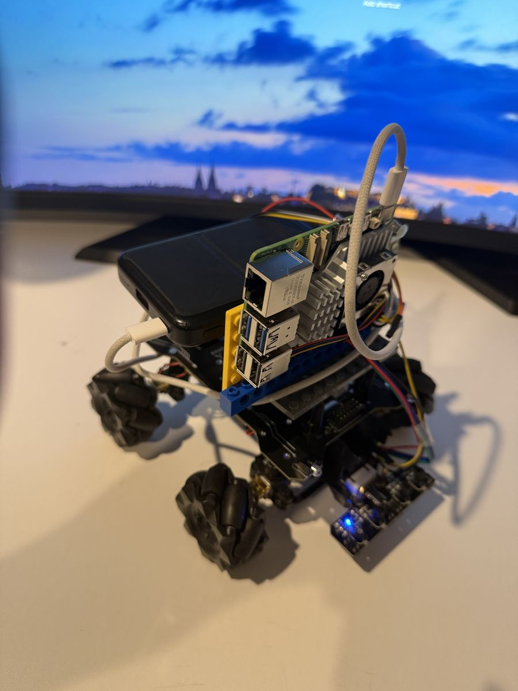

# Car and Robotic Arm



A Raspberry Pi 5 smart car and robotic arm build. This README is a map of the repository, not a
description of it — everything it explains lives in the files it links to.

[GitHub Repository](https://github.com/1DannyYu/IRSENSORCAR) · [Contact Danny on GitHub](https://github.com/1DannyYu)

## How to Explore This Repo

There is no single "read the whole thing" path — start from whichever question you have:

| I want to... | Go to |
|---|---|
| See what the robot looks like and what parts it's built from | [assets/](assets/) |
| See the annotated Task 1 route map with phase markers | [docs/MapWithPhases.png](docs/MapWithPhases.png) |
| Read the Python that drives the robot | [src/carbot/](src/carbot/) |
| Run a hardware check myself | [examples/](examples/) |
| Check that the code is tested | [unit_tests/](unit_tests/) |
| Follow the day-to-day engineering trail (what changed, why, what broke) | [docs/progress/](docs/progress/) |
| Connect from a Mac / work over SSH | [docs/setup/mac-to-raspberry-pi-access.md](docs/setup/mac-to-raspberry-pi-access.md) |
| See exactly what the car runs end to end | [full_run.py](full_run.py) |
| Assess this as a school Software Engineering project | see [For Examiners and Teachers](#for-examiners-and-teachers) below |

## Connect to the Pi and Run an Example

```bash
ssh carpi
cd ~/Car-and-Robotic-Arm
```

(`carpi` is an SSH alias — see [docs/setup/mac-to-raspberry-pi-access.md](docs/setup/mac-to-raspberry-pi-access.md) to set it up.)

This is a motor-moving script: stand beside the car, secure the chassis or lift the wheels, and
be ready to cut power before running it.

```bash
uv run --project ~/Car-and-Robotic-Arm python ~/Car-and-Robotic-Arm/full_run.py
```

Add `--dry-run` to preview the commands without moving the motors.

## Repository Layout

```
Car-and-Robotic-Arm/
├── README.md              You are here
├── full_run.py            The complete Phase 1 -> Phase 2 -> auto-tracing run script
├── docs/                  Written record: setup guides, dated progress logs, reference images
│   ├── setup/             Bring-up and environment setup guides
│   ├── progress/          Dated logs of completed, verified work
│   └── MapWithPhases.png  Annotated Task 1 route map (phase markers)
├── src/carbot/            The importable Python driver and control package
├── examples/              Runnable, numbered scripts that exercise real hardware
├── unit_tests/            Automated tests (pytest), flat, one file per subsystem
└── assets/                Build photos and reference diagrams
```

## For Examiners and Teachers

This repository is also the submission for an 11 Software Engineering assessment.

- [full_run.py](full_run.py) — the actual script the car runs end to end
- [docs/progress/](docs/progress/) — dated, verified evidence of work as it happened, in order
- Git history — commit messages describe the why, not just the what, scoped by top-level folder
