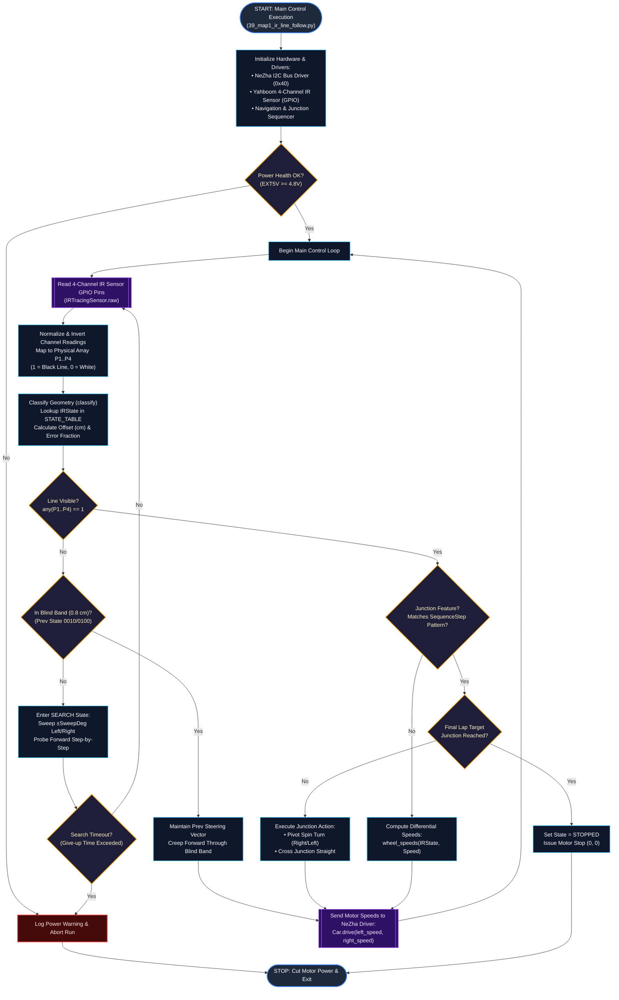

# Flowchart — Autonomous IR Line Following Car System

This document provides the **Flowchart** for the autonomous IR line-following car system (excluding camera, robotic arm, and ultrasonic/sonar sensors).

It illustrates the sequential execution flow, IR sensor sampling, geometry classification, line recovery, junction state machine decisions, and motor drive outputs with smooth curved flowlines.

---

## Mermaid Flowchart Diagram

---

## Process Phase Breakdown

| Phase | Description | Key Source Functions |
|---|---|---|
| **Initialization** | Initializes I2C bus connection at `0x40`, configures GPIO pin mappings for the Yahboom 4-channel IR sensor, and establishes the scripted route plan. | [`NeZha.__init__`](file:///Users/dannyyu/Desktop/IRsensorCar/Car-and-Robotic-Arm/src/carbot/nezha.py), [`IRTracingSensor`](file:///Users/dannyyu/Desktop/IRsensorCar/Car-and-Robotic-Arm/src/carbot/ir_tracing.py) |
| **Power Check** | Validates supply voltage ($\ge 4.8\,\text{V}$) before enabling motor movement. | [`check_power_health`](file:///Users/dannyyu/Desktop/IRsensorCar/Car-and-Robotic-Arm/src/carbot/power.py) |
| **Signal Normalization** | Reads 4 digital GPIO pins, applies inversion mapping, and produces physical channel array $(P1..P4)$ where $1=\text{black line}$ and $0=\text{white}$. | [`IRTracingSensor.read`](file:///Users/dannyyu/Desktop/IRsensorCar/Car-and-Robotic-Arm/src/carbot/ir_tracing.py#L63) |
| **Geometry Classification** | Classifies the 4-bit reading against `STATE_TABLE` into line position offsets ($\text{cm}$) and identifies blind band conditions. | [`classify`](file:///Users/dannyyu/Desktop/IRsensorCar/Car-and-Robotic-Arm/src/carbot/ir_geometry.py#L225), [`STATE_TABLE`](file:///Users/dannyyu/Desktop/IRsensorCar/Car-and-Robotic-Arm/src/carbot/ir_geometry.py) |
| **Junction State Machine** | Sequences multi-step pattern history to recognize track corners/junctions and execute turns or final lap stops. | [`JunctionSequencer`](file:///Users/dannyyu/Desktop/IRsensorCar/Car-and-Robotic-Arm/src/carbot/ir_route.py#L273), [`IRLineNav`](file:///Users/dannyyu/Desktop/IRsensorCar/Car-and-Robotic-Arm/src/carbot/ir_line_nav.py) |
| **Line Recovery Search** | Sweeps left/right and creeps forward step-by-step if the track line is lost (`0000`). | [`IRSearchPhase`](file:///Users/dannyyu/Desktop/IRsensorCar/Car-and-Robotic-Arm/src/carbot/ir_line_nav.py#L126) |
| **Motor Drive Control** | Computes differential wheel speeds and transmits motor control bytes over I2C to NeZha ports `M1`..`M4`. | [`Car.drive`](file:///Users/dannyyu/Desktop/IRsensorCar/Car-and-Robotic-Arm/src/carbot/car.py#L62), [`wheel_speeds`](file:///Users/dannyyu/Desktop/IRsensorCar/Car-and-Robotic-Arm/src/carbot/ir_geometry.py#L254) |
