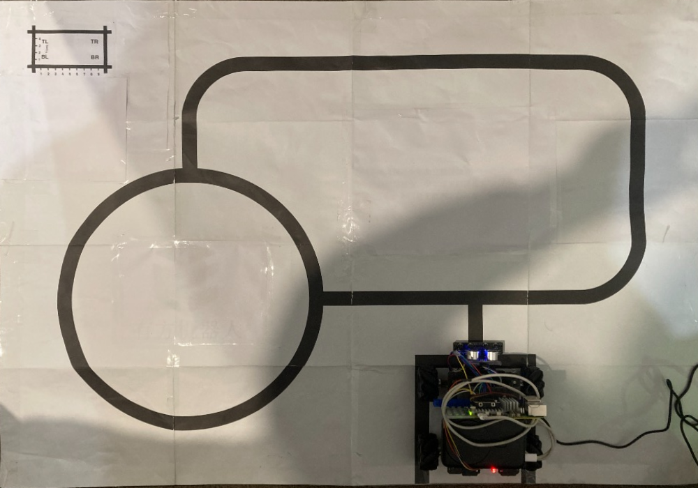

# Task 1 Autonomous Navigation — Single Source of Truth

> This is the authoritative specification for Task 1 line following and roundabout navigation.
> It is based on the latest track photograph, corrected by a 90-degree rotation and an OpenCV
> perspective transform into a 100 cm east-west by 70 cm north-south bird's-eye view. The rendered
> map uses 10 px per centimetre and the planned route is continuous between every phase.

> **2026-08-19 revision:** Task 1 now runs continuous laps. The former Phase 11 return to the start
> box was removed. After Phase 10 reaches the T junction, the car crosses straight into Phase 2.
> Phase 1 runs only once when entering the loop.

> **2026-08-20 correction:** `1111` is not unique. The start T, roundabout entry, and roundabout
> exit can all produce `1111`, and uneven paper can create occasional junction-shaped noise.
> Junction identity therefore depends on route sequence, dwell thresholds, and distance gates;
> no single sensor pattern identifies a location by itself. See
> [`carbot.ir_route`](../src/carbot/ir_route.py) and
> [`tasks/ir-sensor-tracking/design.md`](../tasks/ir-sensor-tracking/design.md).

## 1. Corrected Bird's-Eye Map

The image is a 1000 by 700 px top-down view at 10 px per centimetre. The red route is continuous
from the start box through Phases 1-10. Phase 10 crosses the T junction into the next lap's Phase 2.

## 2. Track Geometry

- Physical size: **100 cm east-west by 70 cm north-south**.
- Output size: **1000 by 700 px** at **10 px/cm**.
- Track: **2 cm solid black line**.
- ARC 1, south-east: approximately **3.6 cm** from `(862,405)` toward `(895,390)`.
- ARC 2, north-east: approximately **14.2 cm** from `(933,210)` toward `(905,75)`.
- ARC 3, north-west: approximately **7.2 cm** from `(320,75)` toward `(290,140)`.
- Roundabout centre: `(292,412)` in image coordinates.
- Roundabout centre-line radius: **18.0 cm**; diameter: **36.0 cm**.
- Roundabout entry: top, near `(292,232)`.
- Roundabout travel: counter-clockwise through 270 degrees, about **84.8 cm**, exiting at the
  3 o'clock position near `(472,412)`.

## 3. Route Phases

| Phase | Segment | Action | Planned distance |
|---:|---|---|---:|
| 1 | Start departure, first lap only | Drive north from the start box, then turn right at the T | 16.0 cm |
| 2 | East straight | Centre on `P0110` and follow east | 16.0 cm |
| 3 | ARC 1, south-east | Follow the tight left curve toward north | about 3.6 cm |
| 4 | East-side straight | Follow north | 19.2 cm |
| 5 | ARC 2, north-east | Follow the left curve toward west | about 14.2 cm |
| 6 | North straight | Follow west | 58.5 cm |
| 7 | ARC 3, north-west | Follow the left curve toward south | about 7.2 cm |
| 8 | Roundabout approach | Follow south to the roundabout entry | 7.5 cm |
| 9 | Roundabout | Travel counter-clockwise for three quarters of a circle | 84.8 cm |
| 10 | Return straight | Turn right at exit 3 and follow east to the T | 23.0 cm |
| Per lap | Continuous loop | Phases 2-10 after the one-time Phase 1 entry | about 244 cm |

The older planned-route evidence under `scratch/line-follow-2026-08-15/` measured 258.9 cm when
the one-time stem and a slightly larger roundabout estimate were included. The difference is
explained by the updated 36.0 cm roundabout diameter and measured corner lengths.

## 4. Environmental Noise Rules

1. The only valid path is the 2 cm solid black track line.
2. Printed text, tables, QR codes, decorative borders, and room objects are visual noise for the
   line-following pipeline.
3. Camera line detection must reject features outside the configured width range. The historical
   working range is `min_line_width_fraction: 0.025` to `max_line_width_fraction: 0.10`.
4. AprilTags are a separate localization channel, not line-following features. The line detector
   still ignores their borders through width filtering.

## 5. Corrected Measurements

| Item | Retired estimate | Current specification |
|---|---:|---:|
| Roundabout centre | `(405,291)` | `(292,412)` |
| Roundabout diameter | 36.7 cm | 36.0 cm |
| Roundabout entry | West side | North side at `(292,232)` |
| Roundabout arc | Wrong 90-to-360-degree quadrant | 270 degrees from 12 to 3 o'clock |
| East vertical track | `x` about 990 | `x` about 895-933 |
| Phase 1 | 16.0 cm | 16.0 cm |
| Phase 2 | 16.0 cm | 16.0 cm |
| Phase 10 | 23.0 cm | 23.0 cm |
| Corner arcs | 23.56 cm each | 3.6 / 14.2 / 7.2 cm |
| Phase 6 | 50.0 cm | 58.5 cm |
| Roundabout travel | 86.47 cm | 84.8 cm |
| Full entry plus one lap | 307.65 cm | about 260 cm |

## 6. AprilTag Localization Layer

### Decision

The chassis has no encoder-backed odometry and no IMU. Timing and dark-band-width heuristics alone
cannot provide a reliable absolute pose. The planned localization layer therefore uses AprilTag
36h11 landmarks. A visible tag gives the camera a six-degree-of-freedom pose that can be converted
to map `(x, y, heading)`. See
[`ADR 0003`](adr/0003-landmark-localization-task1.md) for the complete decision.

### Tag and Coordinate Specification

- Black tag square: **20 mm**.
- White quiet zone: **5 mm** on every side, for a 30 mm total footprint.
- Expected useful detection distance: approximately **60-70 cm** at 2028 by 1520 preview
  resolution, subject to physical validation.
- Map origin: south-west corner.
- Positive X: east; positive Y: north.
- North-east corner: `(1.00, 0.70)` metres.
- Measure each tag centre from the west and south paper edges, then divide centimetres by 100 for
  JSON metre values.
- Image conversion: `map_y_m = 0.70 - image_y_px / 1000`.
- A tag's north arrow points toward the map's north edge when `yaw_deg = 0`.
- Vehicle heading convention: 0 degrees east, 90 north, 180 west, and -90 south.
- Keep every quiet zone at least 2 cm from the track and clear of printed graphics.
- Use the shared 2028 by 1520 preview stream for both localization and line following.

### Draft Tag Positions

These positions are initial design values. Physical measurements recorded after placement become
authoritative.

| Tag | X (cm) | Y (cm) | Purpose |
|---:|---:|---:|---|
| 0 | 5 | 65 | North-west corner |
| 1 | 26 | 58 | Before roundabout entry |
| 2 | 50 | 58 | West part of north straight |
| 3 | 72 | 58 | East part of north straight |
| 4 | 96 | 66 | North-east corner |
| 5 | 95 | 42 | Middle of east side |
| 6 | 95 | 20 | Lower east side |
| 7 | 95 | 5 | South-east corner |
| 8 | 5 | 5 | South-west corner |
| 9 | 5 | 25 | West side of roundabout |
| 10 | 5 | 45 | Upper west side |
| 11 | 74 | 34 | T-junction approach |
| 12 | 58 | 14 | Start box |
| 13 | 60 | 40 | Return-path drift check |
| 14 | 86 | 25 | End of Phase 2 / ARC 1 |
| 15 | 52 | 23 | Roundabout exit 3 |

Exact placement may vary as long as the tag avoids the track and graphics, its north arrow is
oriented correctly, and its measured centre is written to the tag-map JSON. The static validation
tool is `examples/ai_camera/31_cam_ground_tag_pose.py`; it does not move the motors.

### Control Behaviour After Localization Is Available

- End turns from measured tag heading instead of elapsed time.
- Treat the T junction and roundabout exit as location-confirmed events.
- Recover from a lost route when any known tag restores position and heading.
- Use visible tags as absolute map anchors for future SfM capture work.
