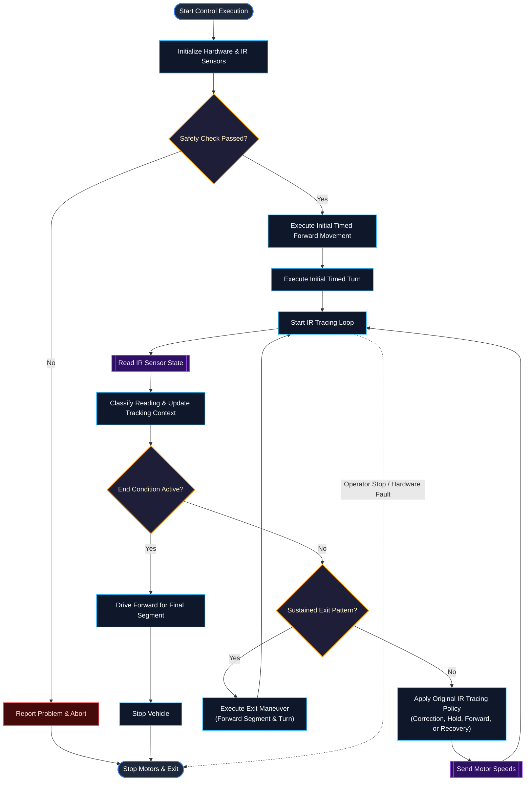

# Structure Chart

```mermaid
flowchart TB
    Start(["Start Control Execution"]) --> Init["Initialize Hardware & IR Sensors"]
    Init --> Safety{"Safety Check Passed?"}
    Safety -- No --> SafetyWarn["Report Problem & Abort"]
    SafetyWarn --> StopExit(["Stop Motors & Exit"])
    Safety -- Yes --> PhaseAdvance["Execute Initial Timed Forward Movement"]
    PhaseAdvance --> PhaseTurn["Execute Initial Timed Turn"]
    PhaseTurn --> LoopStart["Start IR Tracing Loop"]

    LoopStart --> ReadSensors[["Read IR Sensor State"]]
    ReadSensors --> ProcessIR["Classify Reading & Update Tracking Context"]
    ProcessIR --> EndCheck{"End Condition Active?"}
    EndCheck -- Yes --> FinalAdvance["Drive Forward for Final Segment"]
    FinalAdvance --> FinalStop["Stop Vehicle"]
    FinalStop --> StopExit
    EndCheck -- No --> ExitCheck{"Sustained Exit Pattern?"}
    ExitCheck -- Yes --> ExitManeuver["Execute Exit Maneuver<br/>(Forward Segment & Turn)"]
    ExitManeuver --> LoopStart
    ExitCheck -- No --> TracePolicy["Apply Original IR Tracing Policy<br/>(Correction, Hold, Forward, or Recovery)"]
    TracePolicy --> DriveMotors[["Send Motor Speeds"]]
    DriveMotors --> LoopStart

    LoopStart -. Operator Stop / Hardware Fault .-> StopExit

    Start:::startEnd
    Init:::process
    Safety:::decision
    SafetyWarn:::safety
    StopExit:::startEnd
    PhaseAdvance:::process
    PhaseTurn:::process
    LoopStart:::process
    ReadSensors:::io
    ProcessIR:::process
    EndCheck:::decision
    FinalAdvance:::process
    FinalStop:::process
    ExitCheck:::decision
    ExitManeuver:::process
    TracePolicy:::process
    DriveMotors:::io

    classDef startEnd fill:#1e293b,stroke:#3b82f6,stroke-width:2px,color:#ffffff
    classDef process fill:#0f172a,stroke:#38bdf8,stroke-width:1.5px,color:#f8fafc
    classDef decision fill:#1e1e38,stroke:#f59e0b,stroke-width:2px,color:#fef3c7
    classDef safety fill:#450a0a,stroke:#ef4444,stroke-width:2px,color:#fee2e2
    classDef io fill:#2e1065,stroke:#a855f7,stroke-width:1.5px,color:#f3e8ff
```
