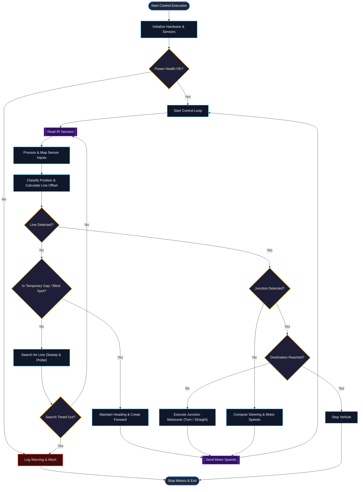

# Structure Chart

```mermaid
flowchart TB
    Start(["Start Control Execution"]) --> Init["Initialize Hardware & Sensors"]
    Init --> Preflight{"Power Health OK?"}
    Preflight -- No --> PowerWarn["Log Warning & Abort"]
    PowerWarn --> StopExit(["Stop Motors & Exit"])
    Preflight -- Yes --> LoopStart["Start Control Loop"]
    LoopStart --> ReadSensors[["Read IR Sensors"]]
    ReadSensors --> NormIR["Process & Map Sensor Inputs"]
    NormIR --> ClassifyIR["Classify Position & Calculate Line Offset"]
    ClassifyIR --> LineVisible{"Line Detected?"}
    LineVisible -- No --> BlindBand{"In Temporary Gap / Blind Spot?"}
    BlindBand -- Yes --> MaintainCreep["Maintain Heading & Creep Forward"]
    MaintainCreep --> DriveMotors[["Send Motor Speeds"]]
    BlindBand -- No --> SearchMode["Search for Line (Sweep & Probe)"]
    SearchMode --> SearchTimeout{"Search Timed Out?"}
    SearchTimeout -- Yes --> PowerWarn
    SearchTimeout -- No --> ReadSensors
    LineVisible -- Yes --> JunctionCheck{"Junction Detected?"}
    JunctionCheck -- Yes --> TargetReached{"Destination Reached?"}
    TargetReached -- Yes --> FinishRun["Stop Vehicle"]
    FinishRun --> StopExit
    TargetReached -- No --> ExecJunction["Execute Junction Maneuver (Turn / Straight)"]
    ExecJunction --> DriveMotors
    JunctionCheck -- No --> CalcSpeed["Compute Steering & Motor Speeds"]
    CalcSpeed --> DriveMotors
    DriveMotors --> LoopStart

     Start:::startEnd
     Init:::process
     Preflight:::decision
     PowerWarn:::safety
     StopExit:::startEnd
     LoopStart:::process
     ReadSensors:::io
     NormIR:::process
     ClassifyIR:::process
     LineVisible:::decision
     BlindBand:::decision
     MaintainCreep:::process
     DriveMotors:::io
     SearchMode:::process
     SearchTimeout:::decision
     JunctionCheck:::decision
     TargetReached:::decision
     FinishRun:::process
     ExecJunction:::process
     CalcSpeed:::process
    classDef startEnd fill:#1e293b,stroke:#3b82f6,stroke-width:2px,color:#ffffff
    classDef process fill:#0f172a,stroke:#38bdf8,stroke-width:1.5px,color:#f8fafc
    classDef decision fill:#1e1e38,stroke:#f59e0b,stroke-width:2px,color:#fef3c7
    classDef safety fill:#450a0a,stroke:#ef4444,stroke-width:2px,color:#fee2e2
    classDef io fill:#2e1065,stroke:#a855f7,stroke-width:1.5px,color:#f3e8ff
```
