# Structure Chart

## Legend & Symbols

| Symbol | Element | Description |
| :---: | :--- | :--- |
| `[ Module Name ]` | **Module** | Functional unit/procedure (simplified, generic description). |
| `───►` | **Call Line** | Direct invocation from a parent module to a sub-module. |
| `○` | **Data Couple** | Parameter or return value passed between modules (Open Circle). |
| `●` | **Control Couple** | Status flag or signal used for decision-making (Filled Circle). |
| `◇` | **Conditional Selection** | Decision point indicating a module is invoked conditionally. |
| `↻` | **Repetition Loop** | Iterative call loop executing repeatedly during runtime. |

---

## Structure Chart Diagram

Current target: `examples/39_map1_ir_line_follow.py` ("Example 39"), aligned with the staged
Phase 1-10 controller introduced on 2026-08-21.

```mermaid
flowchart TB
    Main["Main Control Module"] -- "● Init Ready Flag" --> Init["System Initialization"]
    Main -- "↻ Main Loop | ○ Line Offset | ● Line Detected Flag" --> Sense["Sensory Processing"]
    Main -- "↻ Main Loop | ○ Steering Command" --> Nav["Navigation & Guidance Engine"]
    Main -- "↻ Main Loop | ● Motor Output Sent" --> Motor["Motor Drive Controller"]
    Init -- "● Power OK Flag" --> PwrCheck["Check Power Health"]
    Init -- "● Drivers Active Flag" --> DrvConfig["Configure Hardware Drivers"]
    Sense -- "○ Raw Signals" --> ReadIR["Read Sensor Channels"]
    Sense -- "○ Sensor State" --> MapIR["Map & Normalize Inputs"]
    Sense -- "○ Line Offset | ● Line Detected Flag" --> CalcPos["Calculate Line Offset"]
    Nav -- "◇ Line Visible | ○ Steering Angle" --> TrackLine["Compute Tracking Steering"]
    Nav -- "◇ Blind Spot | ○ Creep Vector" --> CreepGap["Maintain Creep in Blind Spot"]
    Nav -- "◇ Line Lost | ○ Sweep Direction | ● Search Timeout" --> SearchLine["Execute Line Recovery Search"]
    Nav -- "◇ Junction Detected | ○ Turn Direction | ● Destination Reached" --> ExecJunct["Execute Junction Maneuver"]
    Motor -- "○ Left/Right Velocities" --> CalcSpeeds["Compute Wheel Speeds"]
    Motor -- "Transmit Command" --> SendDrive["Transmit Motor Commands"]

    classDef main fill:#1e293b,stroke:#3b82f6,stroke-width:2px,color:#ffffff
    classDef l1 fill:#0f172a,stroke:#38bdf8,stroke-width:1.5px,color:#f8fafc
    classDef l2 fill:#1e1e38,stroke:#a855f7,stroke-width:1.5px,color:#f3e8ff

    class Main main
    class Init,Sense,Nav,Motor l1
    class PwrCheck,DrvConfig,ReadIR,MapIR,CalcPos,TrackLine,CreepGap,SearchLine,ExecJunct,CalcSpeeds,SendDrive l2
```

