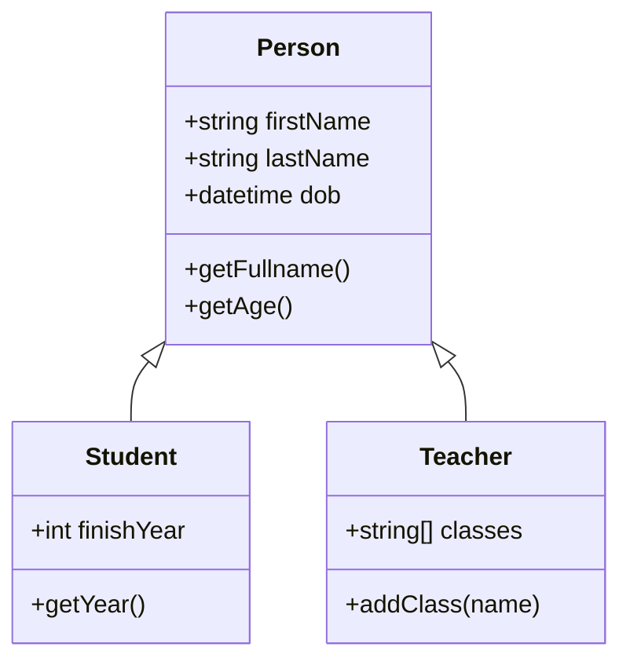
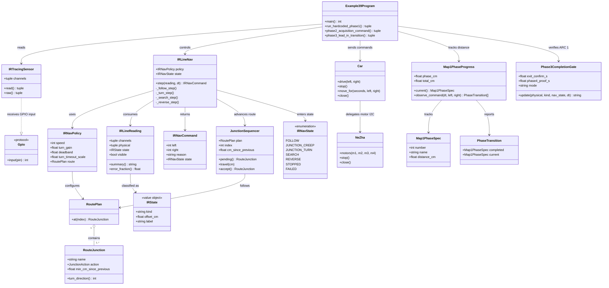

# UML Class Diagrams

## 1. Attached Example Diagram (Person, Student, Teacher)

```mermaid
classDiagram
    class Person {
        +string firstName
        +string lastName
        +datetime dob
        +getFullname()
        +getAge()
    }

    class Student {
        +int finishYear
        +getYear()
    }

    class Teacher {
        +string[] classes
        +addClass(name)
    }

    Person <|-- Student
    Person <|-- Teacher
```

---

## 2. Example 39 UML Class Diagram — Map 1 IR Line Following

```mermaid
classDiagram
    class Example39Program {
        +main() int
        +run_hardcoded_phase1() tuple
        +phase2_acquisition_command() tuple
        +phase3_lead_in_transition() tuple
    }

    class IRTracingSensor {
        +tuple channels
        +read() tuple
        +raw() tuple
    }

    class IRLineReading {
        +tuple channels
        +tuple physical
        +IRState state
        +bool visible
        +summary() string
        +error_fraction() float
    }

    class IRLineNav {
        +IRNavPolicy policy
        +IRNavState state
        +step(reading, dt) IRNavCommand
        -_follow_step()
        -_turn_step()
        -_search_step()
        -_reverse_step()
    }

    class IRNavPolicy {
        +int speed
        +float turn_gain
        +float deadband
        +float turn_timeout_scale
        +RoutePlan route
    }

    class IRNavCommand {
        +int left
        +int right
        +string reason
        +IRNavState state
    }

    class Gpio {
        <<protocol>>
        +input(pin) int
    }

    class Car {
        +drive(left, right)
        +stop()
        +move_for(seconds, left, right)
        +close()
    }

    class NeZha {
        +motors(m1, m2, m3, m4)
        +stop()
        +close()
    }

    class RoutePlan {
        +at(index) RouteJunction
    }

    class RouteJunction {
        +string name
        +JunctionAction action
        +float min_cm_since_previous
        +turn_direction() int
    }

    class JunctionSequencer {
        +RoutePlan plan
        +int index
        +float cm_since_previous
        +pending() RouteJunction
        +travel(cm)
        +accept() RouteJunction
    }

    class Map1PhaseProgress {
        +float phase_cm
        +float total_cm
        +current() Map1PhaseSpec
        +observe_command(dt, left, right) PhaseTransition[]
    }

    class Map1PhaseSpec {
        +int number
        +string name
        +float distance_cm
    }

    class PhaseTransition {
        +Map1PhaseSpec completed
        +Map1PhaseSpec current
    }

    class Phase3CompletionGate {
        +float exit_confirm_s
        +float phase4_proof_s
        +string mode
        +update(physical, kind, nav_state, dt) string
    }

    class IRState {
        <<value object>>
        +string kind
        +float offset_cm
        +string label
    }

    class IRNavState {
        <<enumeration>>
        FOLLOW
        JUNCTION_CREEP
        JUNCTION_TURN
        SEARCH
        REVERSE
        STOPPED
        FAILED
    }

    Example39Program --> IRTracingSensor : reads
    Example39Program --> IRLineNav : controls
    Example39Program --> Car : sends commands
    Example39Program --> Map1PhaseProgress : tracks distance
    Example39Program --> Phase3CompletionGate : verifies ARC 1
    IRTracingSensor ..|> Gpio : receives GPIO input
    IRLineNav --> IRNavPolicy : uses
    IRLineNav --> IRLineReading : consumes
    IRLineNav --> IRNavCommand : returns
    IRLineNav --> JunctionSequencer : advances route
    IRLineNav --> IRNavState : enters state
    IRNavPolicy --> RoutePlan : configures
    JunctionSequencer --> RoutePlan : follows
    RoutePlan "1" o-- "1..*" RouteJunction : contains
    Map1PhaseProgress --> Map1PhaseSpec : tracks
    Map1PhaseProgress --> PhaseTransition : reports
    IRLineReading --> IRState : classified as
    Car --> NeZha : delegates motor I2C
```
