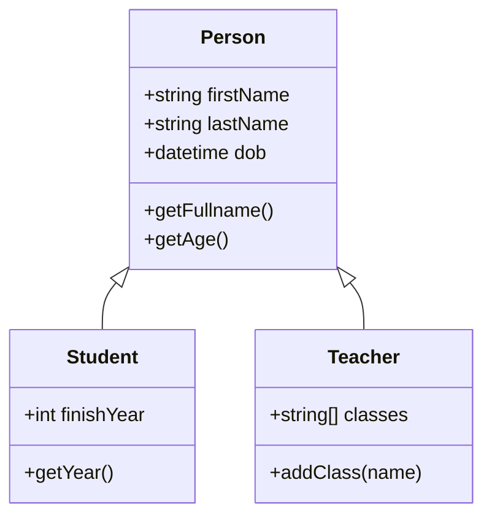
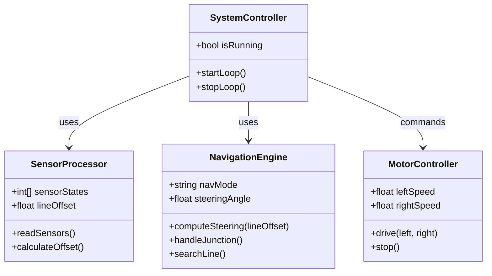

# UML Class Diagrams

## 1. Attached Example Diagram (Person, Student, Teacher)

```mermaid
classDiagram
    class Person {
        +string firstName
        +string lastName
        +datetime dob
        +getFullname()
        +getAge()
    }

    class Student {
        +int finishYear
        +getYear()
    }

    class Teacher {
        +string[] classes
        +addClass(name)
    }

    Person <|-- Student
    Person <|-- Teacher
```

---

## 2. Project Architecture UML Class Diagram (IR Sensor Car)

```mermaid
classDiagram
    class SystemController {
        +bool isRunning
        +startLoop()
        +stopLoop()
    }

    class SensorProcessor {
        +int[] sensorStates
        +float lineOffset
        +readSensors()
        +calculateOffset()
    }

    class NavigationEngine {
        +string navMode
        +float steeringAngle
        +computeSteering(lineOffset)
        +handleJunction()
        +searchLine()
    }

    class MotorController {
        +float leftSpeed
        +float rightSpeed
        +drive(left, right)
        +stop()
    }

    SystemController --> SensorProcessor : uses
    SystemController --> NavigationEngine : uses
    SystemController --> MotorController : commands
```
